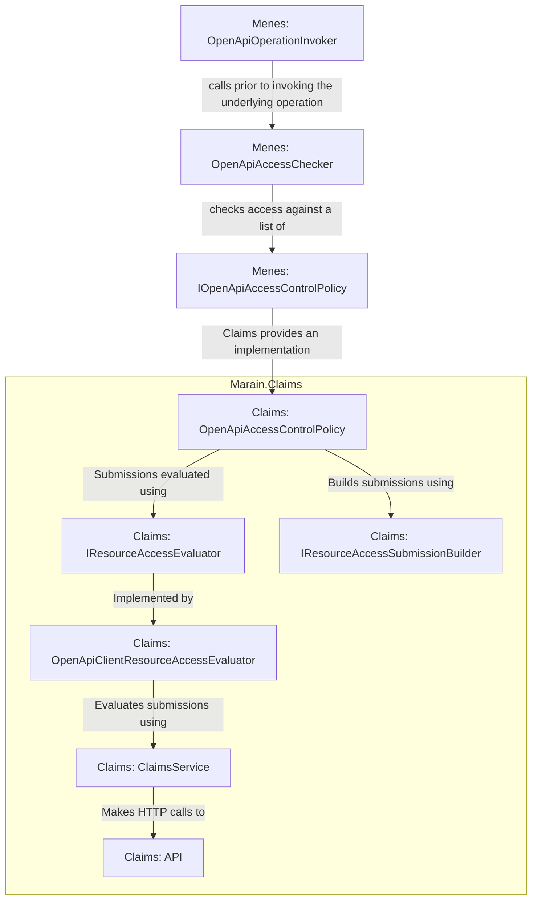

# Menes Integration

Marain Claims provides additional libraries to integrate with APIs built on Menes.

Menes provides an integration point for access control libraries via the `Menes.IOpenApiAccessControlPolicy`. Third parties add functionality by providing an implementation of this in their DI container.

Out of the box, Menes provides two implementations of `IOpenApiAccessControlPolicy`, but they are not intended for standalone use. `ExemptOperationIdsAccessPolicy` maintains a list of operations which are exempt from access checking. The second, `ShortCircuitingAccessControlPolicyAdapter`, provides a means to ensure policies which are able to execute quickly (like `ExemptOperationIdsAccessPolicy`) are executed prior to more expensive policy checks, such as those which call the Claims API over HTTP.

In order to support integration with Menes, Marain Claims provides an `IOpenApiAccessControlPolicy` implementation in `Marain.Claims.OpenApi.OpenApiAccessControlPolicy`. This depends in turn upon two further interfaces: `IResourceAccessSubmissionBuilder`, whose implementors are responsible for building a request in standardised form that is then passsed to an instance of `IResourceAccessEvaluator` which does the work of evaluating the access request.

Marain Claims provides two implementations of `IResourceAccessEvaluator`:
- `Marain.Claims.Client.OpenApi.OpenApiClientResourceAccessEvaluator` uses the `IClaimsClient` provided by `Marain.Claims` to evaulate claims using the batch endpoint.
- `Marain.Claims.Hosting.AspNetCore.LocalResourceAccessEvaluator` uses the `ClaimPermissionsService` directly to evaluate claims. This is intended for the Claims service itself to use when evaluating Claims and isn't intended for use by other services.

Similarly, two implementations of `IResourceAccessSubmissionBuilder` are provided:
- `RoleBasedResourceAccessSubmissionBuilder` - assumes that user roles, accessed from the `CurrentPrincipal` via the `roles` claim, are used to identify the `ClaimPermissions` that should be evaluated for the current user. If the user is in multiple roles, their access to the requested resource will be checked for each.
- `IdentityBasedResourceAccessSubmissionBuilder` - assumes that the user `oid` or `objectidentifier` claims will be used to identify the `ClaimPermissions` to evaluate. If the user has multiple `oid` or `objectidentifier` claims, their access will be checked for each.

All of this is configured by using the extension methods in `OpenApiClaimsServiceCollectionExtensions` in the `Marain.Claims.Client.OpenApi` project. These methods add the  `OpenApiClientResourceAccessEvaluator` implementation of `IResourceAccessEvaluator`, then delegate to their corresponding methods in `OpenApiAccessControlServiceCollectionExtensions` in the `Marain.Claims.OpenApi` project. The results of this are shown in the following table.

|                                                                            | `IOpenApiAccessControlPolicy`                | `IResourceAccessEvaluator`             | `IResourceAccessSubmissionBuilder`             |
|----------------------------------------------------------------------------|----------------------------------------------|----------------------------------------|------------------------------------------------|
| `AddClaimsClientRoleBasedOpenApiAccessControl`                             | `OpenApiAccessControlPolicy`                 | `OpenApiClientResourceAccessEvaluator` | `RoleBasedResourceAccessSubmissionBuilder`     |
| `AddClaimsClientRoleBasedOpenApiAccessControlWithPreemptiveExemptions`     | `ShortCircuitingAccessControlPolicyAdapter`* | `OpenApiClientResourceAccessEvaluator` | `RoleBasedResourceAccessSubmissionBuilder`     |
| `AddClaimsClientIdentityBasedOpenApiAccessControl`                         | `OpenApiAccessControlPolicy`                 | `OpenApiClientResourceAccessEvaluator` | `IdentityBasedResourceAccessSubmissionBuilder` |
| `AddClaimsClientIdentityBasedOpenApiAccessControlWithPreemptiveExemptions` | `ShortCircuitingAccessControlPolicyAdapter`* | `OpenApiClientResourceAccessEvaluator` | `IdentityBasedResourceAccessSubmissionBuilder` |

\* in both of these cases, the `ShortCircuitingAccessControlPolicyAdapter` contains an "exemption policy" and then the normal `OpenApiAccessControlPolicy`. The "exemption policy" is expected to be an implementation of `IOpenApiAccessControlPolcicy` similar to `ExemptOperationIdsAccessPolicy`, which lists URLs that are exempt from claims checking and can thus be quickly evaulated locally without needing to go to the underlying `IResourceAccessEvaluator`.

The following diagram shows how the different components fit together:

